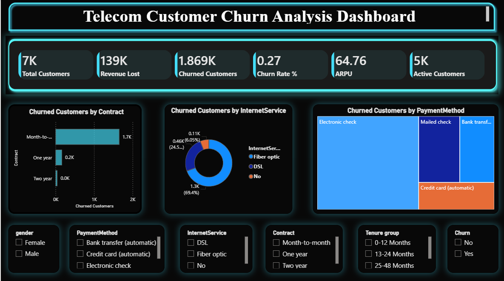
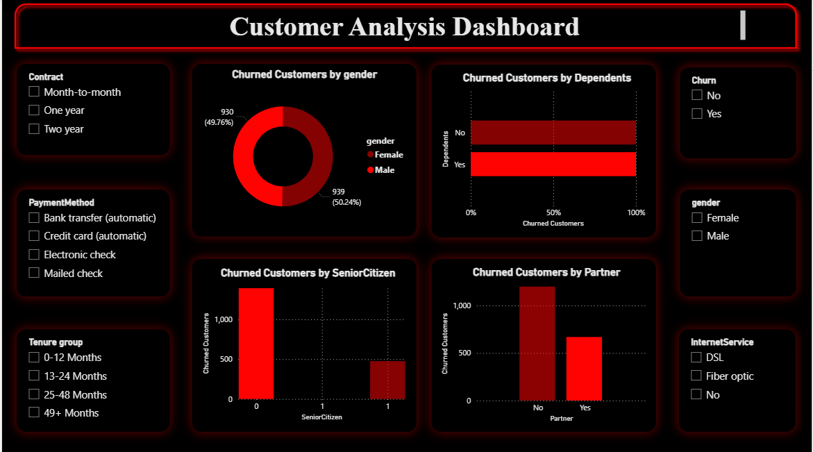
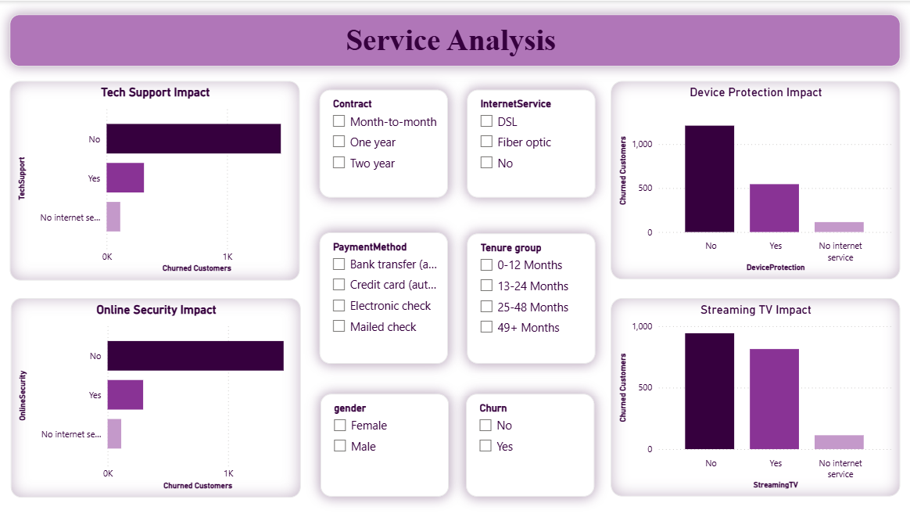
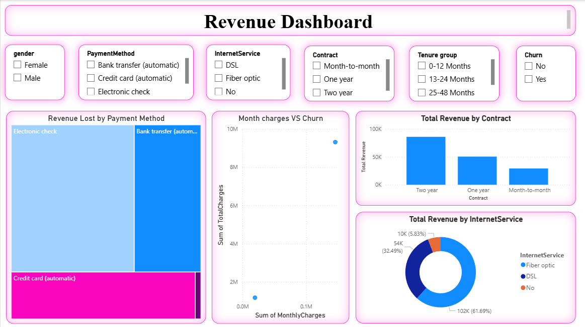

# 📊 Telco Customer Churn Analysis Dashboard

## 🚀 Project Overview

Customer churn is a major challenge in the telecommunications industry. This project uses Power BI to analyze customer churn patterns, identify key factors influencing customer attrition, measure revenue impact, and provide actionable recommendations to improve customer retention.

The dashboard was built using the Telco Customer Churn dataset containing over 7,000 customer records and multiple customer, service, and billing attributes.

---

## 🎯 Business Objectives

* Identify the primary drivers of customer churn.
* Analyze customer demographics and service usage.
* Quantify revenue loss caused by churn.
* Segment high-risk customers.
* Generate actionable retention strategies.

---

## 🛠️ Tools & Technologies

* Power BI Desktop
* Power Query
* DAX (Data Analysis Expressions)
* Data Modeling
* Data Visualization
* Business Analytics

---

## 📂 Dataset Information

| Metric          | Value              |
| --------------- | ------------------ |
| Records         | 7,043              |
| Features        | 21                 |
| Industry        | Telecommunications |
| Target Variable | Churn              |

### Key Features

* Gender
* Senior Citizen
* Partner
* Dependents
* Tenure
* Internet Service
* Contract Type
* Payment Method
* Monthly Charges
* Total Charges
* Churn

---

# 📸 Dashboard Preview

## 1️⃣ Executive Dashboard



### Highlights

* Total Customers
* Churned Customers
* Active Customers
* Churn Rate %
* Revenue Lost
* ARPU (Average Revenue Per User)
* Churn by Contract Type
* Churn by Internet Service
* Churn by Payment Method

### Key Insight

Month-to-month contract customers exhibit significantly higher churn rates compared to long-term contract customers.

---

## 2️⃣ Customer Analysis Dashboard



### Highlights

* Churn by Gender
* Churn by Dependents
* Churn by Senior Citizen
* Churn by Partner Status
* Interactive Customer Segmentation Filters

### Key Insight

Customers without partners and senior citizens show a higher tendency to churn.

---

## 3️⃣ Service Analysis Dashboard



### Highlights

* Tech Support Impact
* Online Security Impact
* Device Protection Impact
* Streaming TV Impact
* Service-Level Churn Analysis

### Key Insight

Customers without Tech Support and Online Security services have significantly higher churn rates.

---

## 4️⃣ Revenue Dashboard



### Highlights

* Revenue Lost by Payment Method
* Monthly Charges vs Churn
* Revenue by Contract Type
* Revenue by Internet Service
* Revenue-Based Customer Analysis

### Key Insight

Electronic Check customers contribute the highest share of revenue loss due to churn.

---

# 📈 DAX Measures Used

### Total Customers

```DAX
Total Customers =
COUNT(Telecom[customerID])
```

### Churned Customers

```DAX
Churned Customers =
CALCULATE(
    COUNT(Telecom[customerID]),
    Telecom[Churn] = "Yes"
)
```

### Active Customers

```DAX
Active Customers =
[Total Customers] - [Churned Customers]
```

### Churn Rate %

```DAX
Churn Rate % =
DIVIDE(
    [Churned Customers],
    [Total Customers]
)
```

### Revenue Lost

```DAX
Revenue Lost =
CALCULATE(
    SUM(Telecom[MonthlyCharges]),
    Telecom[Churn] = "Yes"
)
```

### ARPU

```DAX
ARPU =
DIVIDE(
    SUM(Telecom[MonthlyCharges]),
    [Total Customers]
)
```

---

# 🔍 Key Business Insights

### Customer Insights

* Month-to-month contract customers are most likely to churn.
* New customers (0–12 months tenure) exhibit the highest churn rates.
* Senior citizens are more likely to leave the service.

### Service Insights

* Lack of Tech Support significantly increases churn risk.
* Customers without Online Security churn more frequently.
* Fiber optic customers experience higher churn compared to DSL users.

### Revenue Insights

* Churn leads to substantial monthly revenue loss.
* Electronic Check payment users represent the highest revenue risk.
* Long-term contract customers contribute more stable revenue.

---

# 💡 Recommendations

### Customer Retention

* Encourage migration from month-to-month to long-term contracts.
* Offer loyalty rewards for customers reaching tenure milestones.
* Target high-risk customers with personalized retention offers.

### Service Improvement

* Bundle Tech Support and Online Security with internet plans.
* Promote value-added services to improve customer stickiness.

### Revenue Protection

* Monitor high-value customers proactively.
* Implement churn prediction alerts for at-risk customers.

---

# 📁 Repository Structure

```text
Telco-customer-churn-analysis/
│
├── Data/
│   └── customer_churn.csv
│
├── Dashboard/
│   └── Telecom_Churn_Dashboard.pbix
│
├── Images/
│   ├── Executive_Dashboard.png
│   ├── Customer_Analysis.png
│   ├── Service_Analysis.png
│   └── Revenue_Dashboard.png
│
└── README.md
```

---

# 👨‍💻 Author

**Sasanka Sekhar Satpathy**

Aspiring Data Analyst

### Skills

* SQL
* Power BI
* Excel
* Python
* Statistics
* Data Visualization

GitHub: https://github.com/Sasankasatpathy

---

⭐ If you found this project useful, consider giving the repository a star.
